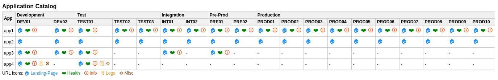

# Application Catalog

A simple, interactive catalog of all your applications, showing:

- Application names
- Deployment stages (development, test, integration, production)
- Environment names (DEV01, DEV02, INT01, etc.)
- URLs for each stage and environment
- Optional status or health check indicators

The project generates a table with clickable icons for each URL, making it easy for teams to:

- Quickly find application endpoints
- Track deployment stages
- Access information and logs efficiently

## Features

- One row per application
- Stage and environment headers
- Clickable icons
- Fully configurable via JSON or YAML
- Select which stages to include (in `generate.py`)

## Getting Started

1. Clone this repository
2. Edit your `data.yaml` to add applications and stages
3. Run `generate.py` to generate `Application-Catalog.html`
4. Open the HTML file in your browser

## License

[MIT License](LICENSE)